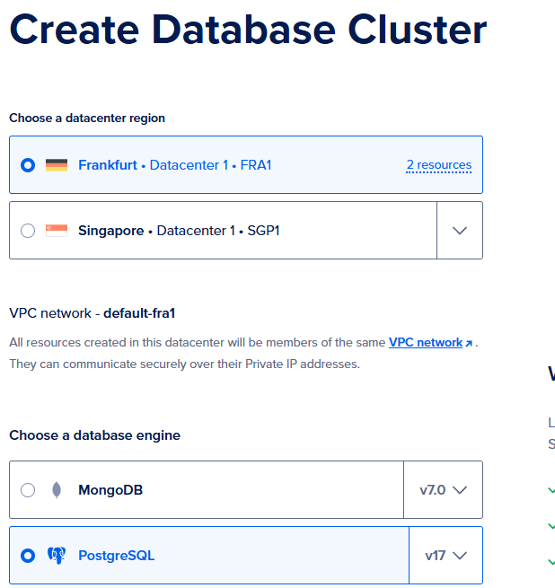
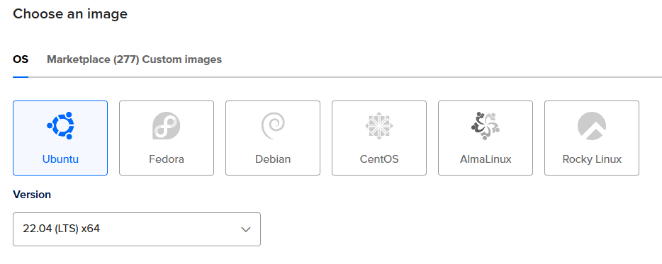

# Deployment in Digital Ocean

In this chapter, we will deploy our Django application to Digital Ocean (DO) Droplet, a Linux-based virtual machines (VMs).

We will also set up a database in DO.

## Set up database in DO

In previous tutorial, we set up PostgreSQL image in `docker-compose.prod.yml` file.

If we directly deploy in this way, we will host the DB together with our web service in the same server, and the data persistence is fully handled through Docker volumes.

In this case, we would need to maintain backups, updates, security, and performance tuning all by our own.

There are also few drawbacks in such setup, e.g. single point of failure, no automatic failover, and limited scalability.

Most importantly, data could be lost if container/volume is corrupted.

Thus for production environment, using DO's managed database is recommended.

Follow the steps below to set up the DB in DO:

### 1. DB setup in DigitalOcean console

* Go to [Digital Ocean Console](https://cloud.digitalocean.com/) and create a Managed Database (PostgreSQL)

  

* Choose region (same as where you'll host your app) and version (here we use PostgreSQL v17 as an example)

  

* Select plan (Start with Basic plan)

  

* After DB is created, you can find the following DB connection information in the Overview page of database console. 

  Please note down the information under VPC network area for later connection purpose:

  ```plaintext
  username = doadmin
  password = ************************
  host = private-db-postgresql-fra1-000000-do-user-00000000-0.g.db.ondigitalocean.com
  port = 25060
  database = defaultdb
  ```

  
  
## Set up Droplet in DO

In the next step, we need to set up a virtual machine (i.e. Droplet) as a server to host our Django app.

Imagine Droplet as a computer located in the data center at the region you choose.

Our tasks are install the required softwares inside this computer and set up our Django app properly in it.

### 1. Droplet setup in DigitalOcean console

* Go to [Digital Ocean Console](https://cloud.digitalocean.com/) and create a new Droplet

  

* Choose region (we will choose the same region as DB so that we can connect them via safer VPC)

  

* Choose OS version (We will use Ubuntu 22.04 LTS as an example)

  

* Select plan (Start with Basic plan)

  

* Add a new SSH key to remote connect to this virtual machine from your local later on

  

  You can follow the step below to generate a new SSH key in your local PC:

  ```bash
  # open the terminal in your PC

  # Using ED25519 (recommended)
  ssh-keygen -t ed25519 -C "your_email@example.com"

  # Copy Your Public Key - copy the output from the following commands
  # For Mac/Linux
  cat ~/.ssh/id_ed25519.pub 

  # For Windows using PowerShell
  Get-Content "$env:USERPROFILE\.ssh\id_ed25519.pub"

  # the output should look similar to ssh-ed25519 xxxxxxxxxxxxxx/xxxxxx/xxxxxxxxxxxxxx your_email@example.com
  ```

  Once public key content is copied, go back to "Choose Authentication Method" section in Droplet creation page.

  Select "SSH Key" and Click "Add SSH Key"

  Then paste your public key content, give it a name, and Click "Add SSH Key"

  

* In final, you can define the hostname of your Droplet and press "Create Droplet" to finish the setup

### 2. Test Droplet connection

* Open a terminal in you local PC and enter the following command

  ```bash
  ssh root@your-droplet-ip

  # for example: root@44.444.444.44
  ```
  
  You can find the ip address of your Dropelet from the ipv4 section in the Droplet dashboard

## Update Django setting.py and env file

### 1. setting.py (maybe this should be put in chapter 10 already)

### 2. prod env

## Prepare server setup scripts

### 1. `setup-server.sh`

### 2. `deploy.sh`

## Set up resources in DO Droplet

### 1. login

### 2. Clone your repository from Github to the Droplet

### 3. Copy env file from local pc to server

### 3. Run setup script

### 4. Run deployment script