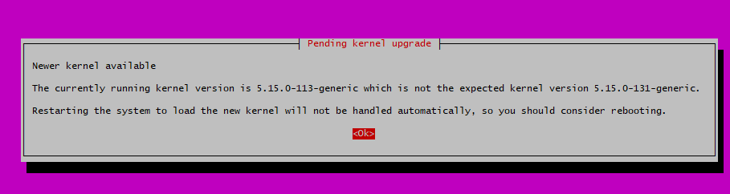

# Deployment in Digital Ocean

In this chapter, we will deploy our Django application to Digital Ocean (DO) Droplet, a Linux-based virtual machines (VMs).

We will also set up a database in DO.

## Set up database in DO

In previous tutorial, we set up PostgreSQL image in `docker-compose.prod.yml` file.

If we directly deploy in this way, we will host the DB together with our web service in the same server, and the data persistence is fully handled through Docker volumes.

In this case, we would need to maintain backups, updates, security, and performance tuning all by our own.

There are also few drawbacks in such setup, e.g. single point of failure, no automatic failover, and limited scalability.

Most importantly, data could be lost if container/volume is corrupted.

Thus for production environment, using DO's managed database is recommended.

Follow the steps below to set up the DB in DO:

### 1. DB setup in DigitalOcean console

* Go to [Digital Ocean Console](https://cloud.digitalocean.com/) and create a Managed Database (PostgreSQL)

  

* Choose region (same as where you'll host your app) and version (here we use PostgreSQL v17 as an example)

  

* Select plan (Start with Basic plan)

  

* After DB is created, you can find the following DB connection information in the Overview page of database console. 

  Please note down the information under VPC network area for later connection purpose:

  ```plaintext
  username = doadmin
  password = ************************
  host = private-db-postgresql-fra1-000000-do-user-00000000-0.g.db.ondigitalocean.com
  port = 25060
  database = defaultdb
  ```

  
  
## Set up Droplet in DO

In the next step, we need to set up a virtual machine (i.e. Droplet) as a server to host our Django app.

Imagine Droplet as a computer located in the data center at the region you choose.

Our tasks are install the required softwares inside this computer and set up our Django app properly in it.

### 1. Droplet setup in DigitalOcean console

* Go to [Digital Ocean Console](https://cloud.digitalocean.com/) and create a new Droplet

  

* Choose region (we will choose the same region as DB so that we can connect them via safer VPC)

  

* Choose OS version (We will use Ubuntu 22.04 LTS as an example)

  

* Select plan (Start with Basic plan)

  

* Add a new SSH key to remote connect to this virtual machine from your local later on

  

  You can follow the step below to generate a new SSH key in your local PC:

  ```bash
  # open the terminal in your PC

  # Using ED25519 (recommended)
  ssh-keygen -t ed25519 -C "your_email@example.com"

  # Copy Your Public Key - copy the output from the following commands
  # For Mac/Linux
  cat ~/.ssh/id_ed25519.pub 

  # For Windows using PowerShell
  Get-Content "$env:USERPROFILE\.ssh\id_ed25519.pub"

  # the output should look similar to ssh-ed25519 xxxxxxxxxxxxxx/xxxxxx/xxxxxxxxxxxxxx your_email@example.com
  ```

  Once public key content is copied, go back to "Choose Authentication Method" section in Droplet creation page.

  Select "SSH Key" and Click "Add SSH Key"

  Then paste your public key content, give it a name, and Click "Add SSH Key"

  

* In final, you can define the hostname of your Droplet and press "Create Droplet" to finish the setup

### 2. Test Droplet connection

* Open a terminal in you local PC and enter the following command

  ```bash
  ssh root@your-droplet-ip

  # for example: root@44.444.444.44
  ```
  
  You can find the ip address of your Dropelet from the ipv4 section in the Droplet dashboard

## create new env file

### 1. prod env

Copy `.env.docker.prod` file from previous tutorial and rename as `.env.docker.digitalocean` under backend root directory `drf-subscription-app-tutorial/backend`

Update the file content as followings.

If you don't have domain name yet, you can use Droplet IP in `ALLOWED_HOSTS`.

The values for all `DATABASE_` variables should be identical to the information displayed in DO database console

```plaintext

# change DEBUG to False when ready to deploy to PROD
DEBUG=False
SECRET_KEY=your-secret-key
ALLOWED_HOSTS=your-backend-domain.com,44.444.444.44
CORS_ALLOWED_ORIGINS=http://your-front-domain.com,https://your-front-domain.com

# Django Database Settings
DATABASE_NAME=defaultdb
DATABASE_USER=doadmin
DATABASE_PASSWORD=your-password
DATABASE_HOST=private-db-postgresql-fra1-000000-do-user-00000000-0.g.db.ondigitalocean.com
DATABASE_PORT=25060

# PostgreSQL Container Settings
POSTGRES_DB=${DATABASE_NAME}
POSTGRES_USER=${DATABASE_USER}
POSTGRES_PASSWORD=${DATABASE_PASSWORD}

LOG_FILE_NAME=debug.log
LOG_FILE_FOLDER=logs
```

## Prepare server setup scripts

### 1. `setup-server.sh`

We need to prepare a script to prepare and install required packages in our Droplet.

We will build `setup-server.sh` under a new folder `drf-subscription-app-tutorial/backend/scripts`.

```bash
#!/bin/bash

# Update system
sudo apt-get update
sudo apt-get upgrade -y

# Install required packages
sudo apt-get install -y \
    apt-transport-https \
    ca-certificates \
    curl \
    software-properties-common \
    certbot \
    python3-certbot-nginx

# Install Docker
# Add Docker's official GPG key
sudo install -m 0755 -d /etc/apt/keyrings
sudo curl -fsSL https://download.docker.com/linux/ubuntu/gpg -o /etc/apt/keyrings/docker.asc
sudo chmod a+r /etc/apt/keyrings/docker.asc

# Add the repository to Apt sources:
echo \
  "deb [arch=$(dpkg --print-architecture) signed-by=/etc/apt/keyrings/docker.asc] https://download.docker.com/linux/ubuntu \
  $(. /etc/os-release && echo "${UBUNTU_CODENAME:-$VERSION_CODENAME}") stable" | \
  sudo tee /etc/apt/sources.list.d/docker.list > /dev/null


# Install Docker packages
sudo apt-get install -y docker-ce docker-ce-cli containerd.io docker-buildx-plugin docker-compose-plugin

# Start and enable Docker service
sudo systemctl start docker
sudo systemctl enable docker

# Verify installation
docker --version
docker compose version

# Stop and disable nginx (from python3-certbot-nginx installation)
sudo systemctl stop nginx
sudo systemctl disable nginx
```

1. Install required packages

    **Essential Packages**:

    * `apt-transport-https`: Allows apt to use HTTPS for repository access.

      Required for secure package downloads. Critical for adding Docker's repository

    * `ca-certificates`: Provides SSL/TLS certificate authority (CA) certificates.

      Required for secure HTTPS connections. Essential for secure package downloads and Docker operations

      More details: [How does SSL/TLS work](https://security.stackexchange.com/questions/20803/how-does-ssl-tls-work/20833#20833)

    * `curl`: Tool for transferring data using various protocols.

      Required for downloading Docker's GPG key. Used in many Docker operations


    * `software-properties-common`: Provides scripts for managing software repositories

      Helps manage PPAs (Personal Package Archives). Required for adding external repositories properly

    **Optional Packages** (Depends on Your Setup):

    * `certbot`: Tool for obtaining SSL certificates from Let's Encrypt.

      Only required if you want free SSL certificates. Could be removed if you're using different SSL solution.

    * `python3-certbot-nginx`: Nginx plugin for Certbot.

      Only required if you're using both Nginx and Certbot. sCould be removed if not using Nginx or different SSL solution

    > We will install nginx via Docker. No need to install in this stage.
  
2. Stop Nginx

  Nginx will be installed as a dependency from `python3-certbot-nginx`.

  Since we run Nginx from our container, this Nginx in Droplet will cause port 80 conflict with our Nginx container. (See more details in Q&A part below)

  Thus we need to disable Nginx right after the download

### 2. `deploy.sh`

We will build a deployment script under backend root folder `drf-subscription-app-tutorial/backend/scripts`

This script will make the files under our project up-to-date and automatically start the server.

```bash

#!/bin/bash

# Pull latest changes
git pull origin main

# Build and deploy
docker compose -f docker-compose.digitalocean.yml down
docker compose -f docker-compose.digitalocean.yml build
docker compose -f docker-compose.digitalocean.yml up -d

# Check logs
docker compose -f docker-compose.digitalocean.yml logs
```

## Set up resources in DO Droplet

### 1. Set up required sources

```bash
# SSH into your Droplet from the terminal in your local pc
ssh root@your-droplet-ip

# Clone your repository (e.g. from Github) to the Droplet
git clone your-repository-url
cd drf-subscription-app-tutorial/backend/

# Run setup script
chmod +x scripts/setup-server.sh
./scripts/setup-server.sh

```

After you execute `setup-server.sh` script, you might receive several update message from the system (from `apt-get update` and `apt-get upgrade` commands). Here we listed some examples:

* **kernel update message**:

  It's part of Ubuntu's standard system update process.

  

  Simply click 'Ok' in the dialog to continue. After setup is complete, reboot your Droplet if the system does not reboot automatically.

  ```bash
  sudo reboot

  # Wait about 30-60 seconds, then reconnect via SSH
  ssh root@your-droplet-ip

  # After reboot, verify the update by checking new kernel version:
  uname -r
  ```

* **configuring openssh-servermessage message**:

  

  This message appears during the system update process (from `apt-get upgrade`) because there's a configuration file change for the OpenSSH server (A new version of openssh-server is available).

  There are two main options in this message window:

  * Install the package maintainer's version:

    * Overwrites your current SSH configuration with the new version
    * Good for fresh installations
    * Could lose custom configurations if you had any

  * Keep the local version currently installed (Recommended in our case):

    * Keeps your current SSH configuration
    * Safer option for a running server
  
  Simply use arrow keys to navigate and press Enter to confirm.

  This is safe because you just created the Droplet and haven't made custom SSH configurations.

* **daemons using outdated libraries message**:

  

  This message appears during the system upgrade process (`apt-get upgrade` installed new library versions) because some system services are using libraries that have just been updated.
  
  The system needs to restart these services to use the new versions. (Doesn't require a full system reboot).

  It will ensures all services use the latest library versions and improves security and stability

  The services shown in the list are system services like:
  * cron.service (task scheduler)
  * dbus.service (system message bus)
  * networkd-dispatcher.service (network management)
  * systemd services (system management)
  * polkit.service (system authorization)

  You can select all services using the space bar and press enter to restart all listed services.


### 2. Copy env file from local pc to server

Since it is not safe to push env file to the online repository, we will directly copy the env file from the local pc to the Droplet.

```bash
# in your local terminal

cd /drf-subscription-app-Tutorial/backend/
scp .env.docker.digitalocean root@your-droplet-ip:/root/drf-subscription-app-Tutorial/backend/
```

```bash
# SSH into your droplet
ssh root@your-droplet-ip

# Check file exists and has correct permissions
ls -la /root/drf-subscription-app-Tutorial/backend/.env.docker.digitalocean

# View file content to verify
cat /root/drf-subscription-app-Tutorial/backend/.env.docker.digitalocean

# Set proper permissions if needed
chmod 600 /root/drf-subscription-app-Tutorial/backend/.env.docker.digitalocean

```

>Regarding chmod 600:
>
>```plaintext
>read = 4, write = 2, execute = 1
>
>For chmod 600:
>    owner  group  others
>    rw-    ---    ---
>    42-    ---    ---
>     6      0      0
>
>For chmod 755:
>    owner  group  others
>    rwx    r-x    r-x
>    421    4-1    4-1
>     7      5      5
>```

### 3. Run deployment script

Run the `deploy.sh` to build the images and run the containers to start the django app

```bash
chmod +x deploy.sh
./deploy.sh
```

## Issues Q&A

### problem on entrypoint.sh permission

If you encounter the error below after run the `deploy.sh`:

```plaintext
Error response from daemon: failed to create task for container: failed to create shim task: OCI runtime create failed: runc create failed: unable to start container process: error during container init: exec: "/app/entrypoint.sh": permission denied: unknown
```

Ensure `entrypoint.sh` has executable permissions:

```bash
# Make entrypoint.sh executable
chmod +x entrypoint.sh

# Verify permissions
ls -l entrypoint.sh
# Should show something like: -rwxr-xr-x

# Stop existing containers
docker-compose -f docker-compose.prod.yml down
# Remove existing images
docker rmi subs_app_prod_web:latest
# Rebuild and start
docker-compose -f docker-compose.prod.yml up -d --build
```

You can check whether the `entrypoint.sh` inside the container has correct permission or not.

```bash
# Access the container
docker exec -it subs_app_prod_web /bin/bash

# Check entrypoint.sh permissions
ls -la /app/entrypoint.sh

# If you need to manually run it:
/app/entrypoint.sh
```

### port 80 is in used

If you encounter the error below after run the `deploy.sh`:

```plaintext
Error response from daemon: driver failed programming external connectivity on endpoint subs_app_prod_nginx (16c4b7f5816dd7ed462344bc7c4e6127d8b8caf6ab18b3aa36cd8ef20188f7d3): failed to bind port 0.0.0.0:80/tcp: Error starting userland proxy: listen tcp4 0.0.0.0:80: bind: address already in use
```

This means that other service is using port 80. (It could be that Nginx has installed already in your Droplet)

```bash
# Check what's using port 80
sudo lsof -i :80
# Or alternatively
sudo netstat -tulpn | grep :80

# Stop and disable system Nginx
sudo systemctl stop nginx
sudo systemctl disable nginx

# Verify it's stopped
sudo systemctl status nginx

```

### how to trouble shooting

Here are different ways to check the logs:

**Docker Container Logs**:

```bash
# Check Django (web) container logs
docker logs subs_app_prod_web

# Check Nginx container logs
docker logs subs_app_prod_nginx

# For continuous monitoring (add -f flag)
docker logs -f subs_app_prod_web
docker logs -f subs_app_prod_nginx
```

**Inside Container Logs**:

```bash
# Access Django container
docker exec -it subs_app_prod_web bash

# Check Gunicorn logs (based on your gunicorn.conf.py)
cat /app/logs/gunicorn_error.log
cat /app/logs/gunicorn_access.log
# Check Django logs (from your settings.py)
cat /app/logs/debug.log

# Access Nginx container
docker exec -it subs_app_prod_nginx bash
# Check Nginx logs
cat /var/log/nginx/access.log
cat /var/log/nginx/error.log
```

### how to reset Droplet and DB

While practicing, you might want to rest your Droplet and DB to its original status and rerun all your scripts.

* Rebuild Droplet:

  Under the "Destroy" section in Droplet console, you can see the "Rebuild Droplet" option.

  Simply select the original image (in our case: Ubuntu 22.04 (LTS) x64) and then click "Rebuild" button.

* Reset Database:

  Login to your database and execute following queries:

  ```sql
  -- Drop all tables
  DROP SCHEMA public CASCADE;
  CREATE SCHEMA public;
  ```

After rebuilding Droplet and re-login by `ssh root@your-droplet-ip`, You will encounter a host key validation error:

```plaintext
@@@@@@@@@@@@@@@@@@@@@@@@@@@@@@@@@@@@@@@@@@@@@@@@@@@@@@@@@@@
@    WARNING: REMOTE HOST IDENTIFICATION HAS CHANGED!     @
@@@@@@@@@@@@@@@@@@@@@@@@@@@@@@@@@@@@@@@@@@@@@@@@@@@@@@@@@@@
IT IS POSSIBLE THAT SOMEONE IS DOING SOMETHING NASTY!
Someone could be eavesdropping on you right now (man-in-the-middle attack)!
It is also possible that a host key has just been changed.
The fingerprint for the ED25519 key sent by the remote host is
SHA256:VW5J2RBMumf4SUGFoq3FEsK+0hhhrhdP9Lz2zyt4Dnl/w.
Please contact your system administrator.
Add correct host key in /c/Users/your-account/.ssh/known_hosts to get rid of this message.
Offending ECDSA key in /c/Users/your-account/.ssh/known_hosts:6
Host key for 44.444.444.44 has changed and you have requested strict checking.
Host key verification failed.
```

Let's first understand what happens during normal SSH connections:

* Client keys (on your computer): Used for your authentication
* Host keys (on the Droplet): Used for server authentication
* Known hosts file (~/.ssh/known_hosts): Stores trusted server fingerprints

Why This Happens:

Initial SSH Connection:

1. You connect to Droplet first time
2. Droplet sends its host key (unique fingerprint)
3. You accept it (type 'yes')
4. Key is stored in ~/.ssh/known_hosts
5. Future connections verify against this stored key

After Rebuild:

1. Droplet is completely reset
2. New OS installation generates new host keys
3. When you connect, Droplet sends new host key
4. SSH client checks ~/.ssh/known_hosts
5. Finds mismatch (old key ≠ new key)
6. Raises security warning

Solution:

Run the following command on your local terminal:

```bash
ssh-keygen -R your-droplet-ip


# See current known hosts entries
cat ~/.ssh/known_hosts
# See backup of old entries
cat ~/.ssh/known_hosts.old

```

This command:

1. Opens ~/.ssh/known_hosts file
2. Finds all entries matching your Droplet's IP
3. Removes these entries
4. Saves backup in ~/.ssh/known_hosts.old
5. Next connection will treat server as new

Summary:

```plaintext
1. Initial Setup:
   - Droplet created with IP 44.444.444.44
   - Generates host keys in /etc/ssh/
   - You connect and accept key
   - Key stored in known_hosts

2. After Rebuild:
   - Same IP, but new host keys
   - SSH client detects key mismatch
   - Shows warning

3. Fix Process:
   - Remove old key (ssh-keygen -R)
   - Connect again
   - Accept new key
   - New key stored in known_hosts
```