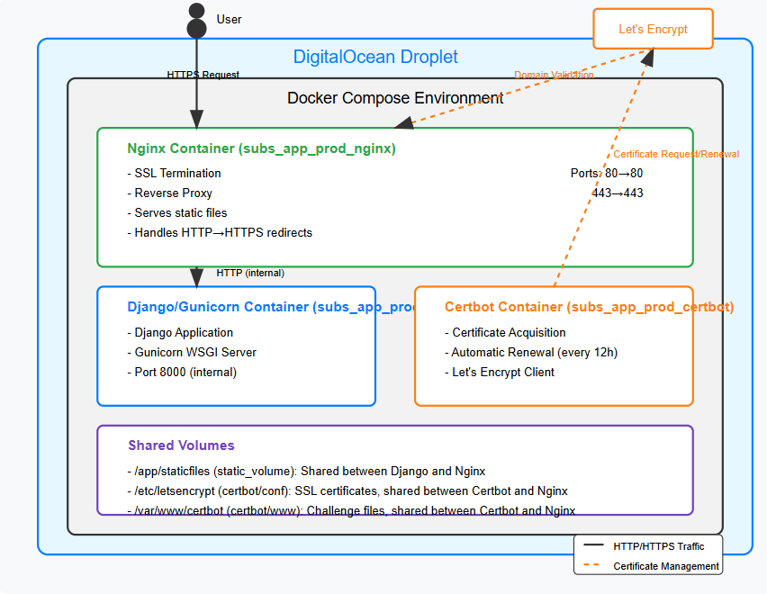

# SSL Certificate for Django App

In this tutorial, we focus on how to secure a containerized Django app running behind an HTTPS Nginx proxy with Let's Encrypt SSL certificates.

After setup, your app will be able to be connected via HTTPS.  In addition, all HTTP connection will be redirected to HTTPS.

This setup uses:

* `Docker containers` for service isolation and deployment consistency
* `Nginx` as a reverse proxy handling SSL termination
* `Certbot` to obtain and renew SSL certificates from Let's Encrypt
* `Django application` running with `Gunicorn` as the WSGI server

Key Configuration Files:

* `nginx.digitalocean.ssl.conf`: Configures Nginx to handle HTTP/HTTPS traffic with SSL
* `Dockerfile.nginx.digitalocean.ssl`: Builds the Nginx container with SSL configuration
* `docker-compose.digitalocean.ssl.yml`: Orchestrates the web, Nginx, and Certbot containers
* `settings.py`: Contains Django SSL security settings
* `get-cert.sh`: Script to obtain and renew SSL certificates

SSL Implementation Strategy:

* HTTP traffic (port 80) gets redirected to HTTPS (port 443) with a 301 redirect
* Let's Encrypt validation accessed through /.well-known/acme-challenge/ path
* Strong TLS configuration (TLS 1.2/1.3, modern ciphers)
* Automatic certificate renewal via Certbot container

## Request Flow Through the System



1. Client Request:

    * A user makes a request to https://my-website.com

2. Nginx SSL Termination:

    * The Nginx container receives the request on port 443
    * It decrypts the SSL/TLS traffic using the certificates in `/etc/letsencrypt/`
    * For HTTP requests to port 80, Nginx redirects to HTTPS with a 301 redirect

3. Proxy to Django:

    * Nginx forwards the decrypted request to the Django container
    * Important headers are added: X-Forwarded-Proto: https, X-Real-IP, etc.

4. Django Processing:

    * Django sees X-Forwarded-Proto: https and treats the request as secure
    * It processes the request and sends a response
    * Secure cookies are set with the secure flag

5. Response Return:

    * Nginx receives the response from Django
    * It encrypts the response with SSL/TLS
    * The encrypted response is sent back to the client

## Background Knowledge for SSL Certificate setup

### About Let's Encrypt

`Let’s Encrypt` issues certificates through an automated API based on the `ACME protocol`.

> The Automatic Certificate Management Environment (ACME) protocol is a communications protocol for automating interactions
>
> between certificate authorities and their users' servers, allowing the automated deployment of public key infrastructure at very low cost.

In order to interact with the Let’s Encrypt API and get a certificate, a piece of software called an `ACME client` is required.

You this tutorial, we will select and operate an ACME client by ourself. We use [Certbot ACME client](https://certbot.eff.org/).

### How Let's Encrypt Validates Your Domain (The Challenge)

Let's Encrypt needs to verify that you actually control the domain before giving you a certificate. Think of it like proving you own a house before getting mail delivered there.

Imagine this conversation:

```plaintext
You: "Hello Let's Encrypt, I'd like a certificate for my-website.com."
Let's Encrypt: "How do I know you control that domain? I'll give you a test. 
               Please create a special file at http://my-website.com/.well-known/acme-challenge/abc123 with content xyz789. 
               When I visit that URL and see that content, I'll know you control the domain."
You: "OK, I've created the file."
Let's Encrypt: [checks the URL] "Great! I can see the file. You've proven you control the domain. Here's your certificate."
```

In our setup:

1. `get-cert.sh` script runs `Certbot` (via `Certificate Signing Request (CSR)`) to ask `Let's Encrypt` for a certificate
2. `Let's Encrypt` gives `Certbot` a random challenge token
3. `Certbot` places this token in `/var/www/certbot/.well-known/acme-challenge/`
4. `Nginx` server is configured to serve files from this location
5. `Let's Encrypt` visits the challenge URL to verify the token
6. If successful, Let's Encrypt issues the certificate. The certificates are stored in `/etc/letsencrypt/live/your-website.com/`

Note:

* The key pair is generated locally on your server within the Certbot container when you run `get-cert.sh`.
* Private key is stored in: `/etc/letsencrypt/live/my-website.com/privkey.pem`
* Public key is embedded in the certificate at `/etc/letsencrypt/live/my-website.com/cert.pem`
* Signed certificate is stored in `/etc/letsencrypt/live/my-website.com/fullchain.pem`
* Certificate Signing Request (CSR) which is singed with the private key contains: domain name, public key, and other identifying information

More details: [how-it-works](https://letsencrypt.org/how-it-works/)

### How SSL Certificate protect data transaction

Step 1: Establishing a Secure Connection

1. A user types https://my-website.com in their browser
2. Their browser connects to your Nginx server on port 443
3. Your Nginx server presents the SSL certificate from Let's Encrypt
4. The browser verifies the certificate is valid and trusted
5. The browser and server perform a `TLS handshake` to create a secure connection:
    * The browser create a random `session key` (i.e. `symmetric key`) and it is encrypted by yours server's public key (from the certificate)
    * The encrypted session key is sent to your server
    * Your Nginx server receives the encrypted session key. It uses your private key (which only exists on your server) to decrypt the session key
    * Now both the browser and your server know the same session key, but nobody else does

Step 2: Encrypting the Traffic

Let's say a user is logging in with username "alice" and password "secure123":

1. The browser encrypts the login data by session key: alice:secure123 becomes something like jH8%fLq!2pX*dR7@
2. This encrypted data and session key is sent over the internet. If someone intercepts the traffic, they only see the encrypted version

Step 3: Decryption at the Server

1. Your Nginx server receives the encrypted traffic
2. Using the session key in the server to decrypt the data
3. The original alice:secure123 is recovered
4. Nginx forwards this decrypted data to your Django application

Step 3: The server encrypts the response

1. Django processes the request and sends back a response
2. Nginx encrypts the response
3. The browser receives and decrypts the response for the user

## Configure Your Domain DNS

SSL certificates are tied to domain names, not IP addresses, because:

* Domain names are human-readable and memorable
* One IP might host multiple domains (virtual hosting)
* SSL validates the identity of a domain, not just encrypting traffic
* Most Certificate Authorities (CAs) won't issue certs for raw IPs

Follow steps below to set up a domain name for your Droplet IP:

1. Set up an A record for your domain (e.g., my-website.com) pointing to your Droplet's IP address

2. Wait for DNS propagation (can take up to 24-48 hours, but often much quicker)

3. Verify with: `dig my-website.com +short` (your Droplet's IP should return if set up correctly)

You can buy domain by any domain registrars For example, Namecheap and Cloudflare.

Here we use Cloudflare as an example:

For DNS configuration:

1. Log into your Cloudflare account
2. If you don't have any domain yet, use `+ Add a domain` button to purchase your domain
3. If you have a domain in Cloudflare, select your domain in Account Home.
4. At `Go to...` search box, search DNS
5. Create a `A record` (i.e. Tyep A) which pointed to IPv4 address if your Droplet
6. Make sure Proxy status is switch to `DNS only` (the cloud icon is GRAY (not orange))

## Update env file and Django settings.py

### 1. ENV file

make sure you add your domain in ALLOWED_HOSTS

```plaintext
ALLOWED_HOSTS=my-website.com,46.101.220.14
```

### 2. settings.py

Add following part in `settings.py`

```python

# SSL setting
SECURE_PROXY_SSL_HEADER = ("HTTP_X_FORWARDED_PROTO", "https")
SECURE_SSL_REDIRECT = True
SESSION_COOKIE_SECURE = True
CSRF_COOKIE_SECURE = True
```

1. `SECURE_PROXY_SSL_HEADER`:

    It tells Django to trust the X-Forwarded-Proto header from Nginx.

    When the Django app sits behind Nginx (as in your case), Django doesn't directly receive the HTTPS connection.

    Instead, Nginx handles the SSL/TLS termination, and forwards the decrypted request to Django over a regular HTTP connection. 

    Without this setting, Django thinks all requests are coming over plain HTTP.

    This setting says: "If Nginx sends me a header called X-Forwarded-Proto with the value https, believe that the original request was indeed HTTPS."

2. `SECURE_SSL_REDIRECT`:

    If a user tries to access your site via plain HTTP, Django will automatically redirect them to the HTTPS version of the same URL.

    This would be technically redundant in our specific setup because we will use Nginx configuration to handles this redirection:

    ```nginx
    # in nginx.digitalocean.ssl.conf
    
    location / {
        return 301 https://$host$request_uri;
    }
    ```

    However, we can still keep it and serve it as a good security fallback

3. `SESSION_COOKIE_SECURE`:

    Ensures that Django only sends session cookies over HTTPS connections.

    The session cookie is how Django keeps track of logged-in users. This setting adds a Secure flag to these cookies,

    telling browsers to only send them back over HTTPS connections, never over plain HTTP.

    This prevents the session cookie from being intercepted by attackers

4. `CSRF_COOKIE_SECURE`:

    CSRF (Cross-Site Request Forgery) tokens protect against attacks where malicious sites try to submit forms to your site using a logged-in user's credentials.

    This setting ensures these protection tokens are only transmitted over HTTPS.

## Set Up Directory Structure in your Droplet

In your Droplet, create directories to store SSL certificates:

```bash
mkdir -p /root/drf-subscription-app-tutorial/data/certbot/www/.well-known/acme-challenge/
mkdir -p /root/drf-subscription-app-tutorial/data/certbot/conf
chmod -R 755 /root/drf-subscription-app-tutorial/data
```

The folder in your droplet would looks like

```plaintext

drf-subscription-app-tutorial/
├─ backend/
│  ├─ scripts/
│  ├─ nginx/
│  ├─ docker-compose.digitalocean.yml
│  ├─ ...
├─ data/
│  ├─ certbot/
│  │  ├─ conf/  (mapped to /etc/letsencrypt in containers)
│  │  ├─ www/   (mapped to /var/www/certbot in containers)

```

however, we don't want `/data/certbot/` directory under our git control.

In the `.gitignore`, we need to add the following entry:

```.gitignore
# certbot relevant directory
/data/certbot/
```

### `/data/certbot/www/.well-known/acme-challenge/`

This directory is used exclusively for domain validation during the certificate issuance and renewal process.

It's where Let's Encrypt verifies that you control the domain before issuing certificates.

The temporary challenge files only exist during the verification process, and are automatically created and removed by Certbot.

We will later create a volume and mapped it to `/var/www/certbot` in the container

### `/data/certbot/conf`

This directory stores all the certificates, private keys, renewal configurations, and Let's Encrypt account information. 

It's the persistent storage for your SSL/TLS credentials.

We will later create a volume and mapped it to `/etc/letsencrypt` in the container.

After the certificate process is kicked off and succeed, you will find following folders and files under this directory

```plaintext

/etc/letsencrypt/
├── accounts/                  # Let's Encrypt account information
│   └── acme-v02...directory/  # Contains your account registration
│       └── ...
├── archive/                   # Archive of all certificates and keys (versioned)
│   └── my-website.com/
│       ├── cert1.pem          # Your certificate (version 1)
│       ├── chain1.pem         # Intermediate certificate(s)
│       ├── fullchain1.pem     # cert1.pem + chain1.pem combined
│       └── privkey1.pem       # Your private key (version 1)
├── csr/                       # Certificate signing requests
│   └── ...
├── keys/                      # Backup of private keys
│   └── ...
├── live/                      # Symlinks to the latest certificates
│   └── my-website.com/
│       ├── cert.pem
│       ├── chain.pem
│       ├── fullchain.pem
│       └── privkey.pem
└── renewal/                   # Renewal configuration files
    └── my-website.com.conf  # Renewal settings for your domain

```

The `/data/certbot/conf` directory should be backed up regularly.

1. live/domain/privkey.pem:

    * Your private key (never shared)
    * Used by Nginx to decrypt HTTPS traffic
    * Referenced in your Nginx config as `ssl_certificate_key`

2. live/domain/fullchain.pem:

    * Contains your certificate + intermediate certificates
    * Sent to browsers to establish trust
    * Referenced in your Nginx config as `ssl_certificate`

3. live/domain/cert.pem:

    * Just your certificate without the chain
    * Rarely used directly (fullchain.pem is preferred)

4. live/domain/chain.pem:

    * Intermediate certificates only
    * Used to establish the trust chain to a root certificate

## Create Nginx Configuration for SSL

### 1. Set up a new nginx conf

Create a new file `nginx.digitalocean.ssl.conf` with contents below under `/backend/nginx` directory:

Please replace all 5 `my-website.com` in the script below to your real domain name

```nginxconf
# Upstream Block
upstream django_backend {
    server web:8000;
}

# HTTP - redirect all requests to HTTPS except for certbot challenge
server {
    listen 80;
    listen [::]:80;

    server_name my-website.com;
    server_tokens off;
    
    # Required for Let's Encrypt certificate enrollment
    location /.well-known/acme-challenge/ {
        root /var/www/certbot;
    }

    location / {
        return 301 https://$host$request_uri;
    }
}

# HTTPS - proxy all requests to Django
server {
    listen 443 ssl;
    server_name my-website.com;
    server_tokens off;

    # SSL certificates
    ssl_certificate /etc/letsencrypt/live/my-website.com/fullchain.pem;
    ssl_certificate_key /etc/letsencrypt/live/my-website.com/privkey.pem;
    
    # SSL parameters
    ssl_protocols TLSv1.2 TLSv1.3;
    ssl_ciphers ECDHE-ECDSA-AES128-GCM-SHA256:ECDHE-RSA-AES128-GCM-SHA256:ECDHE-ECDSA-AES256-GCM-SHA384:ECDHE-RSA-AES256-GCM-SHA384:ECDHE-ECDSA-CHACHA20-POLY1305:ECDHE-RSA-CHACHA20-POLY1305;
    ssl_prefer_server_ciphers off;
    
    # SSL session parameters
    ssl_session_timeout 1d;
    ssl_session_cache shared:SSL:50m;
    ssl_session_tickets off;

    # OCSP Stapling
    ssl_stapling on;
    ssl_stapling_verify on;
    ssl_trusted_certificate /etc/letsencrypt/live/my-website.com/chain.pem;
    resolver 1.1.1.1 8.8.8.8 valid=60s;
    resolver_timeout 5s;

    location / {
        proxy_pass http://django_backend;
        proxy_set_header X-Forwarded-For $proxy_add_x_forwarded_for;
        proxy_set_header Host $host;
        proxy_set_header X-Real-IP $remote_addr;
        proxy_set_header X-Forwarded-Proto $scheme;
        proxy_redirect off;
        client_max_body_size 20M;
    }

    location /static/ {
        alias /app/staticfiles/;
    }
}

```

1. Upstream Block

    This defines a group of servers (in this case just one) that Nginx can proxy requests to.

    This creates a named reference to your Django application that you can use in `proxy_pass`s directives. The name "web" refers to your Django container as defined in docker-compose.

2. HTTP Server Block: Handles HTTP requests on port 80

    Usage:

    * Redirects all traffic to HTTPS except for Let's Encrypt challenge requests
    * Serves .well-known/acme-challenge/ for certificate validation

    Components:

    * Listen Directives:

        ```nginx
        listen 80;
        listen [::]:80;
        ```

        Tells Nginx to listen for HTTP connections on port 80, for both IPv4 (listen 80;) and IPv6 (listen [::]:80;).

    * Server Name:

        ```nginx
        server_name my-website.com;
        ```

        Specifies which domain this server block handles. Nginx might host multiple domains, and this tells it which configuration to use for requests to your domain.

    * Server Tokens:

        ```nginx
        server_tokens off;
        ```

        Prevents Nginx from sending its version number in HTTP headers and error pages.

        It's a security measure that reduces information disclosure about your server.

    * ACME Challenge Location:

        ```nginx
        location /.well-known/acme-challenge/ {
            root /var/www/certbot;
        }
        ```

        Configures Nginx to serve files from Certbot's webroot for Let's Encrypt challenges.

        When access via `my-website.com/.well-known/acme-challenge`, it would bring the files under `/var/www/certbot/.well-known/acme-challenge` in the container.

        Based on our docker volume setup, the same files will also be shared in directory `/data/certbot/www/.well-known/acme-challenge`

    * HTTP to HTTPS Redirect:

        ```nginx
        location / {
            return 301 https://$host$request_uri;
        }
        ```

        Redirects all HTTP requests to HTTPS, except for the ACME challenge location. This ensures all traffic uses encrypted connections for security.


3. HTTPS Server Block: Handles HTTP requests on port 80

    Usage:

    * Configures SSL with modern TLS protocols and strong ciphers
    * Proxies requests to the Django application
    * Serves static files

    Components:

    * SSL Listen Directive:

        ```nginx
        listen 443 ssl;
        ```

        Tells Nginx to listen for HTTPS connections on port 443 and enable SSL for this server block.

    * SSL Certificate Paths:

        ```nginx
        ssl_certificate /etc/letsencrypt/live/backendtest.haodevelop.com/fullchain.pem;
        ssl_certificate_key /etc/letsencrypt/live/backendtest.haodevelop.com/privkey.pem;
        ```

        Specifies the paths to your SSL certificate and private key. These files are required for SSL/TLS encryption.

    * SSL Protocols:

        ```nginx
        ssl_protocols TLSv1.2 TLSv1.3;
        ```

        Specifies which SSL/TLS protocol versions are allowed.

        Older protocols (TLS 1.0, TLS 1.1, SSL 3.0, SSL 2.0) have security vulnerabilities.

        Without this line, Nginx would use default protocols, potentially allowing connections with insecure protocol versions.

    * SSL Ciphers:

        ```nginx
        ssl_ciphers ECDHE-ECDSA-AES128-GCM-SHA256:ECDHE-RSA-AES128-GCM-SHA256:ECDHE-ECDSA-AES256-GCM-SHA384:ECDHE-RSA-AES256-GCM-SHA384:ECDHE-ECDSA-CHACHA20-POLY1305:ECDHE-RSA-CHACHA20-POLY1305;
        ssl_prefer_server_ciphers off;
        ```

        `ssl_ciphers` defines which encryption algorithms are allowed for SSL/TLS connections.

        Some cipher suites have known vulnerabilities or weaknesses. This list includes only strong, modern ciphers.

        `ssl_prefer_server_ciphers` determines whether to use the server's or client's cipher preferences.

        Modern clients (browsers) often have better cipher ordering than servers.

        Without this line, Nginx would use its own cipher preferences, potentially using less optimal ciphers for some clients.

    * SSL Session Parameters:

        ```nginx
        ssl_session_timeout 1d;
        ssl_session_cache shared:SSL:50m;
        ssl_session_tickets off;
        ```

        `ssl_session_timeout`: How long SSL session information is cached
        `ssl_session_cache`: Allocates 50MB of shared memory for caching SSL session information
        `ssl_session_tickets`: Disables stateless session resumption mechanism

        Session caching improves performance by allowing session resumption without full handshakes.

        We disable session tickets to prevent ourself from exposing to potential session ticket vulnerabilities.

        > * What is session tickets:
        >
        >   SSL/TLS session tickets are a mechanism to improve performance by enabling faster reconnections in secure connections (HTTPS).
        >
        >   When a client (like your browser) connects to a server securely, They perform a TLS handshake which involves Cryptographic algorithm negotiation, Certificate validation, Key exchange, and Authentication.
        >
        >   This process is computationally expensive, requiring multiple round trips and cryptographic operations.
        >
        > * How Session Tickets Work:
        >
        >   1. Client and server complete a full TLS handshake. Server generates session parameters (encryption keys, cipher choices, etc.)
        >   2. Server encrypts all these session parameters using a server-side key (the "session ticket key")
        >   3. This encrypted data becomes the "session ticket". Server sends this ticket to the client
        >   4. Client stores this opaque ticket (it can't read the contents)
        >   5. When the client reconnects, it sends the ticket back to the server. Server decrypts the ticket using its session ticket key and retrieves the previous session parameters
        >
        >   This process allows resuming the session without repeating the full handshake
        >
        > * The Security Concern:
        >
        >   1. If an attacker obtains this key, they can decrypt all session tickets (single point of vulnerability)
        >   2. This allows them to recover session information for any connection using these tickets
        >   3. It also potentially allows decryption of recorded TLS traffic that used these tickets

    * OCSP Stapling:

        ```nginx
        ssl_stapling on;
        ssl_stapling_verify on;
        ssl_trusted_certificate /etc/letsencrypt/live/my-website.com/chain.pem;
        resolver 1.1.1.1 8.8.8.8 valid=60s;
        resolver_timeout 5s;
        ```

        OCSP (Online Certificate Status Protocol) stapling allows Nginx to check certificate revocation status and include it in the SSL handshake.

        Without OCSP stapling, clients would need to check certificate revocation separately, slowing down connections.

        `resolver` specifies DNS resolvers for Nginx to use when doing OCSP stapling. (1.1.1.1: Cloudflare ; 8.8.8.8: Google)

        > * The Problem OCSP Stapling Solves:
        >
        >   When a client connects to a secure website, it needs to verify the server's certificate is valid and hasn't been revoked. Traditionally, this happens in two ways:
        >
        >   1. CRL (Certificate Revocation List): Large files listing all revoked certificates
        >   2. OCSP (Online Certificate Status Protocol): Real-time checking with the Certificate Authority
        >
        >   The traditional OCSP process has several issues:
        >
        >   1. Privacy concerns: The CA learns which sites users visit
        >   2. Performance impact: Adds connection latency
        >   3. Reliability problems: If the OCSP server is down, connections might fail or timeout
        >
        > * How OCSP Stapling Works:
        >
        >   1. The web server periodically contacts the OCSP server of its Certificate Authority
        >   2. It requests validation of its own certificate
        >   3. The CA returns a time-stamped, signed OCSP response confirming the certificate status
        >   4. When a client connects, the server "staples" (attaches) this OCSP response to the SSL/TLS handshake
        >   5. The client verifies this signed response came from the proper CA
        >   6. The client accepts the certificate validity without needing to contact the CA directly

    * Proxy to Django:

        ```nginx
        location / {
            proxy_pass http://django_backend;
            proxy_set_header X-Forwarded-For $proxy_add_x_forwarded_for;
            proxy_set_header Host $host;
            proxy_set_header X-Real-IP $remote_addr;
            proxy_set_header X-Forwarded-Proto $scheme;
            proxy_redirect off;
            client_max_body_size 20M;
        }
        ```

        * `proxy_pass http://django_backend;`: Forwards requests to your Django application.

        * `proxy_set_header X-Forwarded-For $proxy_add_x_forwarded_for`:
            Passes client IP information to Django. Without this line, Django would only see Nginx's IP, not the actual client IP, affecting logging and IP-based features.

            It will create a comma-separated list showing the complete chain of proxies.

            If a request passes through multiple proxies:

            ```plaintext
            Original client IP: 203.0.113.1 --> First proxy: 192.168.1.1 --> Your Nginx: 10.0.0.1
            The X-Forwarded-For header with `$proxy_add_x_forwarded_for` would become: 203.0.113.1, 192.168.1.1
            The X-Forwarded-For header with `$remote_addr` would become: 203.0.113.1
            ```

        * `proxy_set_header Host $host;`:
            Passes the original Host header to Django. It tells the server which website to serve.

            If a user visits https://my-website.com/api/auth/, the Host header will be my-website.com.

            Other options:

            ```plaintext
            proxy_set_header Host $http_host;
                - Includes the host and port (e.g., backendtest.haodevelop.com:443)
                - Useful if your backend application needs to know the port

            proxy_set_header Host $server_name;
                - Uses the server name defined in the Nginx configuration
                - Useful if you want to force a specific hostname regardless of the client request
            ```

        * `proxy_set_header X-Real-IP $remote_addr`:
            Passes the client's IP address to Django. Simpler than X-Forwarded-For as it only contains a single IP address

            Alternative options:

            ```plaintext
            proxy_set_header X-Real-IP $http_x_forwarded_for;

            Uses the first IP from an existing X-Forwarded-For header
            Useful if Nginx is behind another proxy and you trust that proxy's XFF header
            ```

        * `proxy_set_header X-Forwarded-Proto $scheme;`: Tells Django whether the original request was HTTP or HTTPS.
        * `proxy_redirect off;`: Prevents Nginx from rewriting Location headers from your application.
        * `client_max_body_size 20M;`: Sets maximum size for client request bodies (e.g., file uploads).

    * Static Files Location:

        ```nginx
        location /static/ {
            alias /app/staticfiles/;
        }
        ```

        Serves static files directly from Nginx instead of passing requests to Django.

        Nginx serves static files much more efficiently than Django.

### 2. Set up a new nginx Dockerfile

Create a new file `Dockerfile.nginx.digitalocean.ssl` with contents below under `/backend/nginx` directory:

```Dockerfile
FROM nginx:1.25-alpine

# Remove default nginx config
RUN rm /etc/nginx/conf.d/default.conf

# Copy our custom config
COPY nginx.digitalocean.ssl.conf /etc/nginx/conf.d/default.conf
```

## Update Docker Compose Configuration

Create a new file `docker-compose.digitalocean.ssl.yml` with contents below under `/backend` directory:

```yml

version: '3.8'

services:
  web:
    container_name: subs_app_prod_web
    build:
      context: .
      dockerfile: Dockerfile.prod
    image: subs_app_prod_web:latest
    volumes:
      - static_volume:/app/staticfiles
      - logs_volume:/app/logs
    env_file:
      - .env.docker.digitalocean
    expose:
      - 8000
    restart: unless-stopped
  
  nginx:
    container_name: subs_app_prod_nginx
    build:
      context: ./nginx
      dockerfile: Dockerfile.nginx.digitalocean.ssl
    image: subs_app_prod_nginx:latest
    volumes:
      - static_volume:/app/staticfiles
      - logs_volume:/app/logs
      - ../data/certbot/conf:/etc/letsencrypt
      - ../data/certbot/www:/var/www/certbot
    ports:
      - "80:80"
      - "443:443"
    depends_on:
      - web
    command: "/bin/sh -c 'while :; do sleep 6h & wait $${!}; nginx -s reload; done & nginx -g \"daemon off;\"'"
    restart: unless-stopped
  
  certbot:
    image: certbot/certbot
    container_name: subs_app_prod_certbot
    volumes:
      - ../data/certbot/conf:/etc/letsencrypt
      - ../data/certbot/www:/var/www/certbot
    entrypoint: "/bin/sh -c 'trap exit TERM; while :; do certbot renew --webroot --webroot-path=/var/www/certbot --quiet; sleep 12h & wait $${!}; done;'"
    restart: unless-stopped

volumes:
  static_volume:
    name: subs_app_prod_static_files
  logs_volume:
    name: subs_app_prod_logs

```

Services:

* Web Service: our Django application with Gunicorn
* Nginx Service: Reverse proxy with SSL termination
* Certbot Service: Automatic certificate renewal

Volume Mounts:

* static_volume: Django static files
* logs_volume: Application logs
* certbot/conf: Let's Encrypt certificates and configuration
* certbot/www: Webroot for Let's Encrypt challenges

`"/bin/sh -c 'while :; do sleep 6h & wait $${!}; nginx -s reload; done & nginx -g \"daemon off;\"'"`: Reloads Nginx every 6h to pick up new certificates
`"/bin/sh -c 'trap exit TERM; while :; do certbot renew --webroot --webroot-path=/var/www/certbot --quiet; sleep 12h & wait $${!}; done;'"` Attempts certificate renewal every 12h

Here, we uses the default Certbot behavior, which typically keeps the same key pair but generates a new CSR and gets a new certificate. (i.e. renew certificate but not key pair)

Let's rewrite both command to more readable way to easily understand:

```bash
#!/bin/bash

# Start Nginx in the background
nginx -g "daemon off;" &   # When you run a command followed by & in bash, that command runs in the background, and $! gives you its PID.
NGINX_PID=$!

# Start an infinite loop that reloads Nginx every 6 hours

while true; do
  # Sleep for 6 hours in the background
  sleep 6h &
  wait $!   # Wait for the sleep PID to complete (this line is technically redundent)

  # Reload Nginx
  echo "Reloading Nginx configuration..."
  nginx -s reload
done &

# Wait for the Nginx process to finish (which should be never unless it crashes)
wait $NGINX_PID

# In Docker containers, having at least one foreground process is vital to keep the container running.
# Thus in the one line command, `nginx -g "daemon off` is put in the end of command to run in the foreground
```

```bash
#!/bin/bash

# Set up a handler for the TERM signal to exit cleanly
# When Docker tries to stop the container gracefully (with docker stop), it sends a TERM signal
# Without this line, the script would continue running its infinite loop, ignoring the signal
trap "echo 'Received SIGTERM, exiting...'; exit" TERM

# Check for certificate renewal every 12 hours
while true; do
  # Attempt to renew certificates that are due
  echo "Checking for certificates that need renewal..."
  certbot renew --webroot --webroot-path=/var/www/certbot --quiet
  
  # Sleep for 12 hours before checking again
  echo "Next renewal check in 12 hours"
  sleep 12h
done
```

If you want to renew key pair, change certbot entry point (adding `--key-type rsa` an `--rsa-key-size 4096`):
`"/bin/sh -c 'trap exit TERM; while :; do certbot renew --webroot --webroot-path=/var/www/certbot --key-type rsa --rsa-key-size 4096 --quiet; sleep 12h & wait $${!}; done;'"`

Or manually run (see more details in the next section - Create Certificate Acquisition Script):

```bash
# Obtain a new certificate with a new key
docker run --rm \
  -v "/root/drf-subscription-app-tutorial/data/certbot/conf:/etc/letsencrypt" \
  -v "/root/drf-subscription-app-tutorial/data/certbot/www:/var/www/certbot" \
  certbot/certbot certonly --webroot -w /var/www/certbot \
  -d $DOMAIN \
  --email $EMAIL \
  --agree-tos \
  --no-eff-email \
  --force-renewal \
  --key-type rsa \
  --rsa-key-size 4096 \
  $STAGING_FLAG
```

## Create Certificate Acquisition Script

Create a new file `get-cert.sh` with contents below under `/backend/scripts` directory.

Please keep the content as followings. We will change Domain and Email later directly in the Droplet.

```bash
#!/bin/bash

DOMAIN=my-website.com  # Replace with your domain
EMAIL=your-email@example.com  # Replace with your email
STAGING=1  # Set to 0 for production, 1 for staging

# Stop any running services that might use port 80
docker compose -f docker-compose.digitalocean.ssl.yml stop nginx

# Determine the correct Let's Encrypt server URL
if [ "$STAGING" -eq 1 ]; then
  STAGING_FLAG="--staging"
  echo "Running in STAGING mode - certificates will NOT be trusted by browsers"
else
  STAGING_FLAG=""
  echo "Running in PRODUCTION mode - certificates will be trusted by browsers"
fi

# Remove any previous certificates to start fresh
rm -rf /root/drf-subscription-app-tutorial/data/certbot/conf/live/*
rm -rf /root/drf-subscription-app-tutorial/data/certbot/conf/archive/*
rm -rf /root/drf-subscription-app-tutorial/data/certbot/conf/renewal/*
rm -rf /root/drf-subscription-app-tutorial/data/certbot/conf/accounts/


# Start a temporary Nginx for webroot authentication
docker run --rm -d --name temp-nginx \
  -v "/root/drf-subscription-app-tutorial/data/certbot/www:/usr/share/nginx/html" \
  -p 80:80 \
  nginx:alpine

# Give Nginx a moment to start
sleep 2

# Obtain a new certificate using webroot
docker run --rm \
  -v "/root/drf-subscription-app-tutorial/data/certbot/conf:/etc/letsencrypt" \
  -v "/root/drf-subscription-app-tutorial/data/certbot/www:/var/www/certbot" \
  certbot/certbot certonly --webroot -w /var/www/certbot \
  -d $DOMAIN \
  --email $EMAIL \
  --agree-tos \
  --no-eff-email \
  --force-renewal \
  $STAGING_FLAG

# Stop temporary Nginx
docker stop temp-nginx

# Verify the certificate
docker run --rm \
  -v "/root/drf-subscription-app-tutorial/data/certbot/conf:/etc/letsencrypt" \
  certbot/certbot certificates

# Start nginx and other services
docker compose -f docker-compose.digitalocean.ssl.yml up -d
```

The workflow in this script:

* Temporarily stops the Nginx container to free port 80
* Uses a temporary Nginx container to serve the ACME challenge files
* Runs Certbot in a container to obtain the initial certificate
* Restarts the main services with the new certificate

Initial Certificate Acquisition

* The `get-cert.sh` script is run manually when setting up the server
* It stops any running Nginx instances and starts a temporary one
* `Certbot` container obtains certificates from `Let's Encrypt` using the `webroot` method
* `Let's Encrypt` validates domain ownership by accessing files in `/.well-known/acme-challenge/`
* Certificates are stored in the `/data/certbot/conf` directory (mounted to `/etc/letsencrypt` in containers)

Besides using staging flag, you can also directly define the server to get staging certificate or production certificate.

```bash
# Determine the correct Let's Encrypt server URL
if [ "$STAGING" -eq 1 ]; then
  SERVER_URL="https://acme-staging-v02.api.letsencrypt.org/directory"
  echo "Running in STAGING mode - certificates will NOT be trusted by browsers"
else
  SERVER_URL="https://acme-v02.api.letsencrypt.org/directory"
  echo "Running in PRODUCTION mode - certificates will be trusted by browsers"
fi

#....

# Obtain a new certificate using webroot
docker run --rm \
  -v "/root/drf-subscription-app-tutorial/data/certbot/conf:/etc/letsencrypt" \
  -v "/root/drf-subscription-app-tutorial/data/certbot/www:/var/www/certbot" \
  certbot/certbot certonly --webroot -w /var/www/certbot \
  -d $DOMAIN \
  --email $EMAIL \
  --agree-tos \
  --no-eff-email \
  --force-renewal \
  --server $SERVER_URL

```

In case you have problem on getting initial certificate (maybe due to different nginx setup), you can try to use standalone approach in `get-cert.sh`.

Once you can get the initial certificate, you can switch back to webroot approach and debug why only standalone approach works.

```bash
#!/bin/bash

DOMAIN=my-website.com  # Replace with your domain
EMAIL=your-email@example.com  # Replace with your email
STAGING=1  # Set to 0 for production, 1 for staging

# Stop any running services that might use port 80
docker compose -f docker-compose.digitalocean.ssl.yml stop nginx

# Determine the correct Let's Encrypt server URL
if [ "$STAGING" -eq 1 ]; then
  SERVER_URL="https://acme-staging-v02.api.letsencrypt.org/directory"
  echo "Running in STAGING mode - certificates will NOT be trusted by browsers"
else
  SERVER_URL="https://acme-v02.api.letsencrypt.org/directory"
  echo "Running in PRODUCTION mode - certificates will be trusted by browsers"
fi

# Remove any previous certificates to start fresh
rm -rf /root/drf-subscription-app-tutorial/data/certbot/conf/live/*
rm -rf /root/drf-subscription-app-tutorial/data/certbot/conf/archive/*
rm -rf /root/drf-subscription-app-tutorial/data/certbot/conf/renewal/*
rm -rf /root/drf-subscription-app-tutorial/data/certbot/conf/accounts/


# Obtain a new certificate using standalone approach
docker run --rm \
  -v "/root/drf-subscription-app-tutorial/data/certbot/conf:/etc/letsencrypt" \
  -v "/root/drf-subscription-app-tutorial/data/certbot/www:/var/www/certbot" \
  -p 80:80 \
  certbot/certbot certonly --standalone \
  -d $DOMAIN \
  --email $EMAIL \
  --agree-tos \
  --no-eff-email \
  --force-renewal \
  --server $SERVER_URL

# Verify the certificate
docker run --rm \
  -v "/root/drf-subscription-app-tutorial/data/certbot/conf:/etc/letsencrypt" \
  certbot/certbot certificates

# Start nginx and other services
docker compose -f docker-compose.digitalocean.ssl.yml up -d
```

You can see followings for the details on these two approaches.

> **Standalone vs. Webroot: Let's Encrypt Certificate Approaches**
>
> 1. Differences Between Approaches:
>
>       Standalone Mode
>
>       * How it works: Certbot spins up its own temporary web server on port 80
>       * Requirements: Port 80 must be free (requires stopping your Nginx)
>       * Simplicity: Simpler to configure initially
>       * Downtime: Requires stopping any existing web server
>
>       Webroot Mode
>
>       * How it works: Uses your existing web server to serve ACME challenge files
>       * Requirements: Your web server must be properly configured to serve files from the certbot webroot
>       * Complexity: Slightly more complex initial setup
>       * Downtime: No downtime needed, works alongside your running web server
>
> 2. When to Use Each Approach
>
>       Use Standalone When:
>
>       * Setting up certificates for the first time on a new server
>       * Troubleshooting certificate issues
>       * Working in development environments
>       * Your web server configuration is complex or problematic
>       * You can tolerate brief downtime during certificate operations
>
>       Use Webroot When:
>
>       * Running in production environments
>       * Continuous operation is required
>       * Automatic renewal needs to work without intervention
>       * Your web server is already properly configured
>       * You need zero-downtime certificate management
>
> 3. Best Practice for Production
>
>       The webroot approach is definitely the better choice for production environments because:
>
>       * Consistent Method: Using the same method for both initial acquisition and renewals ensures compatibility
>       * Zero Downtime: Certificates can be renewed without interrupting service
>       * Automation Friendly: Works seamlessly with automated renewal processes
>       * Standard Practice: It's the industry-standard approach for production systems

## Obtain SSL Certificate and Start Services

Push all changes above to your Github

ssh to your droplet and follow the steps below

```bash

ssh root@your-droplet-ip

# remove existed containers
cd /root/drf-subscription-app-tutorial/backend
docker compose -f docker-compose.digitalocean.ssl.yml down

# pull latest changes
cd /root/drf-subscription-app-tutorial
git pull origin main

# build images based on latest changes
cd /root/drf-subscription-app-tutorial/backend
docker compose -f docker-compose.digitalocean.ssl.yml build --no-cache

# update get-cert.sh
vi /root/drf-subscription-app-tutorial/backend/scripts/get-cert.sh
# press i to go into insert mode 
# update values in DOMAIN and EMAIL (due to rate limit, please keep STAGING=1 in testing)
# press Esc, and type :wq to save


# execute get-cert.sh
chmod +x /root/drf-subscription-app-tutorial/backend/scripts/get-cert.sh
cd /root/drf-subscription-app-tutorial/backend
./scripts/get-cert.sh
```

## Test connection

Verify your HTTPS setup via:

```bash
curl -v https://my-website.com
```

If everything set up correctly, you should see:

```plaintext
* Connected to my-website.com (your-droplet-ip) port 443 (#0)
* ALPN, offering h2
* ALPN, offering http/1.1
*  CAfile: /etc/ssl/certs/ca-certificates.crt
*  CApath: /etc/ssl/certs
* TLSv1.0 (OUT), TLS header, Certificate Status (22):
* TLSv1.3 (OUT), TLS handshake, Client hello (1):
* TLSv1.2 (IN), TLS header, Certificate Status (22):
* TLSv1.3 (IN), TLS handshake, Server hello (2):
* TLSv1.2 (IN), TLS header, Finished (20):
* TLSv1.2 (IN), TLS header, Supplemental data (23):
* TLSv1.3 (IN), TLS handshake, Encrypted Extensions (8):
* TLSv1.2 (IN), TLS header, Supplemental data (23):
* TLSv1.3 (IN), TLS handshake, Certificate (11):
* TLSv1.2 (OUT), TLS header, Unknown (21):
* TLSv1.3 (OUT), TLS alert, unknown CA (560):
* SSL certificate problem: unable to get local issuer certificate
* Closing connection 0
curl: (60) SSL certificate problem: unable to get local issuer certificate
More details here: https://curl.se/docs/sslcerts.html

curl failed to verify the legitimacy of the server and therefore could not
establish a secure connection to it. To learn more about this situation and
how to fix it, please visit the web page mentioned above.
```

You can also check that your site is accessible in a web browser (e.g. https://my-website.com/api/auth/test/)

you will also see a certificate warning in your browser.

The reason for the SSL certificate problem above is that our certificate is still using Let's Encrypt's staging environment which is why browsers and curl don't trust it.

We need to do followings to get the certificate from Let's Encrypt's production environment:

```bash
ssh root@your-droplet-ip

# update get-cert.sh
vi /root/drf-subscription-app-tutorial/backend/scripts/get-cert.sh
# press i to go into insert mode 
# update values in STAGING to production mode (i.e. STAGING=0)
# press Esc, and type :wq to save

# execute again get-cert.sh
./scripts/get-cert.sh
```

Now you will see:

```plaintext
* Connected to my-website.com (your-droplet-ip) port 443 (#0)
* ALPN, offering h2
* ALPN, offering http/1.1
*  CAfile: /etc/ssl/certs/ca-certificates.crt
*  CApath: /etc/ssl/certs
* TLSv1.0 (OUT), TLS header, Certificate Status (22):
* TLSv1.3 (OUT), TLS handshake, Client hello (1):
* TLSv1.2 (IN), TLS header, Certificate Status (22):
* TLSv1.3 (IN), TLS handshake, Server hello (2):
* TLSv1.2 (IN), TLS header, Finished (20):
* TLSv1.2 (IN), TLS header, Supplemental data (23):
* TLSv1.3 (IN), TLS handshake, Encrypted Extensions (8):
* TLSv1.2 (IN), TLS header, Supplemental data (23):
* TLSv1.3 (IN), TLS handshake, Certificate (11):
* TLSv1.2 (IN), TLS header, Supplemental data (23):
* TLSv1.3 (IN), TLS handshake, CERT verify (15):
* TLSv1.2 (IN), TLS header, Supplemental data (23):
* TLSv1.3 (IN), TLS handshake, Finished (20):
* TLSv1.2 (OUT), TLS header, Finished (20):
* TLSv1.3 (OUT), TLS change cipher, Change cipher spec (1):
* TLSv1.2 (OUT), TLS header, Supplemental data (23):
* TLSv1.3 (OUT), TLS handshake, Finished (20):
* SSL connection using TLSv1.3 / TLS_AES_256_GCM_SHA384
* ALPN, server accepted to use http/1.1
* Server certificate:
*  subject: CN=bmy-website.com
*  start date: Mar  2 10:59:24 2024 GMT
*  expire date: May 31 10:59:23 2024 GMT
*  subjectAltName: host "my-website.com" matched cert's "my-website.com"
*  issuer: C=US; O=Let's Encrypt; CN=E6
*  SSL certificate verify ok.
```

And when you check your site via a web browser (e.g. https://my-website.com/api/auth/test/), you should also see no warning and can directly use this test api in DRF UI

## Test certificate renew process

Let's Encrypt certificates operate with the following timeline:

* Certificates are valid for 90 days
* The Certbot container runs continuously, checking for renewal every 12 hours
* When certificates are nearing expiration (30 days before), it automatically renews them`
* For renewal, Certbot uses the webroot method, placing challenge files in `/var/www/certbot`
* Nginx reloads every 6 hours to pick up newly renewed certificates

You can check your certificate status by `docker exec subs_app_prod_certbot certbot certificates`
To properly test that your automatic certificate renewal will work when needed, here are three methods:

### 1. Test Renewal with Dry Run

The most straightforward way to test the renewal process without actually affecting your certificates:

```bash
# Run a manual renewal simulation
docker exec subs_app_prod_certbot certbot renew --webroot --webroot-path=/var/www/certbot --dry-run

# A successful dry-run will show something like:
# Congratulations, all renewals succeeded. The following certs have been renewed:
#   /etc/letsencrypt/live/my-website.com/fullchain.pem (success)
```

If this works, your renewal configuration is correct.

### 2. Inspect Container Logs:

Check if the renewal attempts are being properly logged:

```bash
# Check if the container is running
docker ps | grep certbot

# Check the letsencrypt logs inside the container
docker exec subs_app_prod_certbot grep "renewal" /var/log/letsencrypt/letsencrypt.log

# You should see:
#DEBUG:certbot._internal.display.obj:Notifying user: Processing /etc/letsencrypt/renewal/my-website.com.conf
#DEBUG:certbot._internal.display.obj:Notifying user: Certificate not yet due for renewal
#DEBUG:certbot._internal.display.obj:Notifying user: The following certificates are not due for renewal yet:
#DEBUG:certbot._internal.display.obj:Notifying user: No renewals were attempted.
#DEBUG:certbot._internal.renewal:no renewal failures

```

You should see log entries showing renewal attempts every 12 hours.

### 3. Force Manual Renewal Test

Force a renewal to see if the complete renewal process works (including Nginx picking up new certificates):

```bash
# Force a renewal regardless of expiration date
docker exec subs_app_prod_certbot certbot renew --webroot --webroot-path=/var/www/certbot --force-renewal
```

After running this, wait a few minutes for Nginx's automatic reload cycle, then check if HTTPS is still working correctly:

```bash
curl -v https://my-website.com
```

## Other checking

In case you need to have a deeper look on how the config or certificate looks like, following commands might be helpful.

```bash
# check whether your config in container is correct
docker exec -it subs_app_prod_nginx cat /etc/nginx/conf.d/default.conf

# If you encounter permission issues with the certificate files, check:
docker exec -it subs_app_prod_nginx ls -la /etc/letsencrypt/live/my-website.com/

# Let's Encrypt uses symbolic links for certificates, so let's check that they're working properly:
docker exec -it subs_app_prod_nginx readlink -f /etc/letsencrypt/live/my-website.com/fullchain.pem
docker exec -it subs_app_prod_nginx readlink -f /etc/letsencrypt/live/my-website.com/privkey.pem
```

## DEBUGGING (Optional reading materials)

If you face issue on getting new certificate, we can break the process down into smaller and verifiable steps.

We need to break this down into smaller, verifiable steps:z

1. First, get Nginx running with a minimal configuration (HTTP only)
2. Verify the ACME challenge path (`.well-known/acme-challenge/`) is accessible
3. Once HTTP is working, obtain certificates with Certbot
4. Finally, enable HTTPS with the obtained certificates

### Step 1: Create a minimal HTTP-only Nginx configuration

update your nginx configuration `nginx.digitalocean.ssl.conf`

```nginxconf
upstream django_backend {
    server web:8000;
}

server {
    listen 80;
    listen [::]:80;

    server_name my-website.com;
    server_tokens off;
    
    # Required for LE certificate enrollment
    location /.well-known/acme-challenge/ {
        root /var/www/certbot;
    }

    location / {
        proxy_pass http://django_backend;
        proxy_set_header X-Forwarded-For $proxy_add_x_forwarded_for;
        proxy_set_header Host $host;
        proxy_set_header X-Real-IP $remote_addr;
        proxy_redirect off;
        client_max_body_size 20M;
    }

    location /static/ {
        alias /app/staticfiles/;
    }
}
```

Make sure your `Dockerfile.nginx.digitalocean.ssl` still copy from this config file.

```Dockerfile
FROM nginx:1.25-alpine

# Remove default nginx config
RUN rm /etc/nginx/conf.d/default.conf

# Copy our custom config
COPY nginx.digitalocean.ssl.conf /etc/nginx/conf.d/default.conf
```

### Step 2: Update docker-compose to use HTTP only

modify your docker-compose file to use this HTTP-only configuration:

```yml
version: '3.8'

services:
  web:
    container_name: subs_app_prod_web
    build:
      context: .
      dockerfile: Dockerfile.prod
    image: subs_app_prod_web:latest
    volumes:
      - static_volume:/app/staticfiles
      - logs_volume:/app/logs
    env_file:
      - .env.docker.digitalocean
    expose:
      - 8000
    restart: unless-stopped
  
  nginx:
    container_name: subs_app_prod_nginx
    build:
      context: ./nginx
      dockerfile: Dockerfile.nginx.digitalocean
    image: subs_app_prod_nginx:latest
    volumes:
      - static_volume:/app/staticfiles
      - logs_volume:/app/logs
      - ../data/certbot/www:/var/www/certbot
    ports:
      - "80:80"
    depends_on:
      - web
    restart: unless-stopped

volumes:
  static_volume:
    name: subs_app_prod_static_files
  logs_volume:
    name: subs_app_prod_logs
```

### Step 3: Create a test file for verification

Create a test file under `.well-known/acme-challenge`

```bash
mkdir -p /root/drf-subscription-app-tutorial/data/certbot/www/.well-known/acme-challenge/
echo "This is a test file" > /root/drf-subscription-app-tutorial/data/certbot/www/.well-known/acme-challenge/test.txt
chmod -R 755 /root/drf-subscription-app-tutorial/data
```

### Step 5: Check if Nginx is running and test the ACME challenge path

If this works and returns "This is a test file", we can proceed with obtaining the certificate.

```bash
docker ps
docker logs subs_app_prod_nginx
curl -v http://my-website.com/.well-known/acme-challenge/test.txt
```

### Step 6: Create a simple certbot script

update `get-cert.sh`:

```bash
#!/bin/bash

DOMAIN=my-website.com  # Replace with your domain
EMAIL=myemail@example.com  # Replace with your email
STAGING=0 # Set to 1 if you're testing your setup

# Create a temporaray certbot container to obtain the certificate
docker run --rm -it \
  -v "/root/drf-subscription-app-tutorial/data/certbot/conf:/etc/letsencrypt" \
  -v "/root/drf-subscription-app-tutorial/data/certbot/www:/var/www/certbot" \
  certbot/certbot certonly --webroot \
  -w /var/www/certbot \
  -d $DOMAIN \
  --email $EMAIL \
  --agree-tos \
  --no-eff-email \
  --force-renewal \
  --staging

echo "Certificate should now be obtained. Check the directory:"
ls -la /root/drf-subscription-app-tutorial/data/certbot/conf/live/
```

execute the script

```bash
chmod +x /root/drf-subscription-app-tutorial/backend/scripts/get-cert.sh
cd /root/drf-subscription-app-tutorial/backend
./scripts/get-cert.sh
```

### Step 8: Create the SSL Nginx configuration

If all steps above works and the certificate was obtained successfully, you should have no problem to get certificate and access the app via HTTPS via the approach we provided in the beginning of this tutorial.

Change `nginx.digitalocean.ssl.conf`, `get-cert.sh`, and `docker-compose.digitalocean.ssl.yml` back to original setup and run followings:

```bash
cd /root/drf-subscription-app-tutorial/backend
docker compose -f docker-compose.digitalocean.ssl.yml down
docker compose -f docker-compose.digitalocean.ssl.yml up -d --build
curl -v https://my-website.com
```
