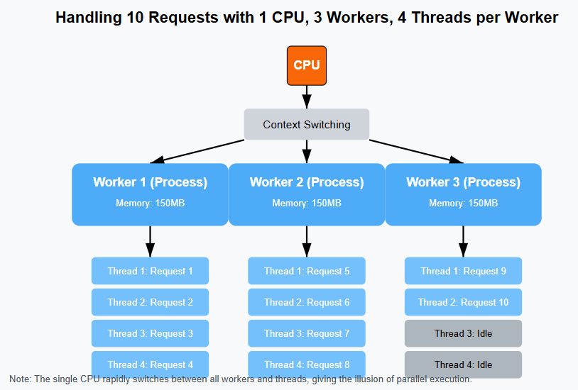
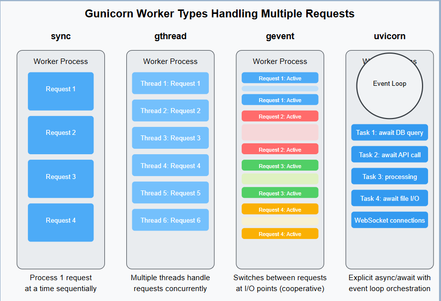

# More Production Setup

We will further improve our Django app to make it production ready.

The list below contains all suggested items:

* Generate and update SECRET_KEY
* Set up database backups
* Configure proper Gunicorn workers
* Add HTTP security headers
* Implement rate limiting
* Add basic health check endpoint

## Generate and update SECRET_KEY

Django's SECRET_KEY is used in several critical security functions:

1. Cryptographic Signing:

    * Session data (cookies containing user authentication)
    * CSRF (Cross-Site Request Forgery) tokens that protect your forms
    * Password reset tokens
    * All signed data using Django's signing utilities

2. Hashing and Encryption:

    * As a salt in various cryptographic operations
    * To secure tokens and cookies
    * To ensure cryptographic operations are unique to your application

It is the cornerstone of Django's security features and creates the uniqueness in your application's security mechanisms

If someone obtains your SECRET_KEY, they could potentially:

* Forge authentication credentials - Create valid session cookies to impersonate any user
* Hijack active user sessions - Take over logged-in user accounts
* Bypass CSRF protection - Submit malicious forms that appear legitimate
* Generate valid password reset tokens - Reset anyone's password
* Decrypt any data that was encrypted using Django's encryption utilities

It is highly recommended to generate a new SECRET_KEY before going live.

When you change your SECRET_KEY:

* All existing sessions will be invalidated (users will need to log in again)
* All CSRF tokens will be invalidated (forms in progress will fail)
* All signed data will become invalid

Following command can be used to regenerate secret key

```bash
# Linux
python3 -c "import secrets; print(secrets.token_urlsafe(50))"

# Windows
python -c "import secrets; print(secrets.token_urlsafe(50))"
```

The command should generate a random string like `4Vt7rt_HLPAakH4Eb6og9Tl2Ykq0_8kO9kPcD0jbYrTt-sBJhXS87iiV41G4YbbT`

Replace the value in your env file (e.g. `.env.docker.digitalocean`) file:

```plaintext
SECRET_KEY=your-new-generated-key-here
```

You can use `scp` to copy the env file to your virtual machine or simply update the env file in your virtual machine with this new value

One env file in Droplet is changed, you would need to restart the Docker containers:

```bash
# Navigate to your project directory
cd /root/drf-subscription-app-tutorial/backend

# Restart the containers
docker compose -f docker-compose.digitalocean.ssl.yml down
docker compose -f docker-compose.digitalocean.ssl.yml up -d
```

You can check whether new SECRET_KEY is loaded or not by:

```bash
# See full secret key
docker exec subs_app_prod_web env | grep SECRET_KEY

# Or Run a Django shell command that shows just the first few characters
docker exec subs_app_prod_web python -c "import os; key = os.environ.get('SECRET_KEY', ''); print(f'SECRET_KEY starts with: {key[:5]}...')"
```

## DB Backup

DigitalOcean's managed database service does include automated backups (for 7 days by default).

However, followings are reasons can consider supplemental backups:

1. Longer retention: If you need to keep backups beyond 7 days
2. Data portability: If you want backups that can be easily moved to other systems
3. Higher frequency: If daily backups aren't frequent enough
4. Defense in depth: Protection against cloud provider issues or accidental deletion
5. Regulatory compliance: Some industries require multiple backup strategies

If you consider to include the DB backup, following scripts can be used:

1. Check where you have the required dependencies installed:

    ```bash
    # Check for PostgreSQL client tools
    pg_dump --version
    # Check for gzip
    gzip --version


    # If the command returns "command not found", you'll need to install them:
    apt-get update
    # Install PostgreSQL client tools
    apt-get install -y postgresql-client
    # Install gzip (usually already included in most Linux distributions)
    apt-get install -y gzip
    ```

2. create a script to dump PostgreSQL data regularly

    ```bash
    #!/bin/bash
    # save as /root/scripts/backup-db.sh

    # Set variables
    BACKUP_DIR="/root/backups/db"
    LOG_DIR="/root/backups/logs"
    TIMESTAMP=$(date +"%Y%m%d_%H%M%S")
    DB_NAME="database name"
    DB_USER="db user"
    DB_HOST="your-db-host"
    DB_PORT="db port"
    DB_PASSWORD="your-password"

    # Ensure directories exist
    mkdir -p $BACKUP_DIR
    mkdir -p $LOG_DIR

    # Log file for this backup
    LOG_FILE="$LOG_DIR/backup_${TIMESTAMP}.log"

    # Function for logging
    log() {
        echo "$(date +'%Y-%m-%d %H:%M:%S') - $1" | tee -a $LOG_FILE
    }

    # Start backup process
    log "Starting database backup"

    # Test database connection
    if PGPASSWORD=$DB_PASSWORD psql -h $DB_HOST -p $DB_PORT -U $DB_USER -d $DB_NAME -c "SELECT 1" > /dev/null 2>&1; then
        log "Successfully connected to database"
    else
        log "ERROR: Could not connect to database"
        exit 1
    fi


    # Create backup
    BACKUP_FILE="$BACKUP_DIR/db_backup_$TIMESTAMP.sql.gz"
    log "Creating backup: $BACKUP_FILE"

    if PGPASSWORD=$DB_PASSWORD pg_dump -h $DB_HOST -p $DB_PORT -U $DB_USER $DB_NAME | gzip > "$BACKUP_FILE"; then
        log "Backup completed successfully"
        log "Backup size: $(du -h $BACKUP_FILE | cut -f1)"
    else
        log "ERROR: Backup failed"
        exit 1
    fi


    # Remove backups older than 7 days
    log "Cleaning up old backups"
    find $BACKUP_DIR -name "db_backup_*.sql.gz" -mtime +7 -delete
    find $LOG_DIR -name "backup_*.log" -mtime +14 -delete

    log "Backup process completed"
    ```

3. Make it executable and schedule it with cron:

    ```bash
    chmod +x /root/scripts/backup-db.sh

    # Edit crontab
    crontab -e

    # Add this line to run daily at 2 AM:
    0 2 * * * /root/scripts/backup-db.sh >> /root/backups/logs/cron.log 2>&1
    ```

To check if backups are running successfully:

```bash
# Check the latest backup log
cat $(ls -t /root/backups/logs/backup_*.log | head -1)

# Check the cron log
cat /root/backups/logs/cron.log

# Verify backup files exist and check their size
ls -lh /root/backups/db/
```

If you need to restore from a backup:

```bash
# Connect to create a fresh database (may require admin privileges)
PGPASSWORD=$DB_PASSWORD psql -h $DB_HOST -p $DB_PORT -U $DB_USER -d postgres

# Inside the PostgreSQL prompt:
DROP DATABASE IF EXISTS defaultdb;
CREATE DATABASE defaultdb;
\q

# Then restore
PGPASSWORD=$DB_PASSWORD psql -h $DB_HOST -p $DB_PORT -U $DB_USER -d defaultdb -f /tmp/restore.sql
```

## Configure proper Gunicorn workers

Create a new `gunicorn.digitalocean.conf.py` under `/backend` directory:

```python

import multiprocessing

# Workers and threads configuration
cpu_count = multiprocessing.cpu_count()
workers = cpu_count * 2 + 1
threads = cpu_count * 2  # 2 threads per core is a good starting point

# The socket to bind
bind = "0.0.0.0:8000"

# Worker class configuration
worker_class = "gthread"  # Use threaded worker

# Performance tuning
worker_tmp_dir = "/dev/shm"  # Use memory for temp files to improve performance

# Process management
timeout = 120  # Timeout for worker processes
graceful_timeout = 30  # Time to finish serving requests before restart
max_requests = 1000    # Restart workers after this many requests
max_requests_jitter = 50  # Add randomness to avoid all workers restarting together

# Connection settings
backlog = 2048  # Maximum number of pending connections
keepalive = 5  # Keep connections open for 5 seconds

# Logging
accesslog = '-'
errorlog = '-'
loglevel = 'info'
access_log_format = '%({x-forwarded-for}i)s %(l)s %(u)s %(t)s "%(r)s" %(s)s %(b)s "%(f)s" "%(a)s" %(L)s'
```

And update the last line of codes in `entrypoint.sh`

```bash
exec gunicorn backend.wsgi:application -c gunicorn.digitalocean.conf.py
```

There are few updates in gunicorn configuration comparing to the previous version.

1. add worker class `gthread`:

    The default worker class is `sync`. It can processes one request at a time in a linear fashion.

    To improve the performance, we add `worker_class = "gthread"` to switch to a Multi-threading approach.

    With this setup, your multiple CPU cores can then process on multiple requests in parallel.

    Even you have only one CPU, this approach can still use the CPU in a more efficient way (e.g. release CPU to other thread while waiting for I/O).

2. properly configure workers and threads

    * CPU, Workers, and threads:

        Let's first understand the relationship between CPU, Workers, and threads:

        

        Each `CPU` core can execute one instruction stream at a time (With 1 CPU core, only one thing can truly run at any instant)

        Each `worker` is a separate OS process (a complete copy of your Django app). Workers run independently and don't share memory

        With 1 CPU core and 3 workers (2×1+1), you have 3 separate Django processes.

        `Threads` exist within a worker process. They share the same memory space.

        Python's `Global Interpreter Lock (GIL)` means only one thread in a worker (process) executes Python code at a time.

        However, the GIL is released during I/O operations (database queries, network calls).

        Each worker is a separate Python process with its own GIL and memory space. And threads Within a Worker: Share the same memory and are controlled by the same GIL

        In the example, one CPU can only deal with only 1 request. However, if the request is waiting for I/O operations, then CPU can be released to deal with other request in the same or another worker.

        This is way more efficient then the `sync` process to always wait for the first request to be fully processed and then jump to another request.

        If we give the example one additional CPU, with 2 CPU cores and 3 workers, two worker processes could execute Python code truly in parallel.

    * cpu and worker configuration

        To properly use multi-threading approach with `gthread`, we have following configurationss:

        ```python
        cpu_count = multiprocessing.cpu_count()
        workers = cpu_count * 2 + 1
        threads = cpu_count * 2
        ```

        * `multiprocessing.cpu_count()`:

            This line can calculate system available cpu. You can also hard coded the value for cpu_count if you are clear about how many cpu cores your droplet has.

            You can also run following command to directly see the result:

            ```bash
            docker exec subs_app_prod_web python -c "import multiprocessing; print(f'Available CPUs are: {multiprocessing.cpu_count()}...')"
            ```

        * `workers = cpu_count * 2 + 1`: (cpu_count * 2 + 1) is a good and practical formula to calculate a proper number of workers based on your CPU.

        * `threads = cpu_count * 2`:

            A good rule of thumb:

            For I/O-heavy applications (like yours with database and API operations): 2-4 threads per CPU core

            For balanced workloads: 2 threads per CPU core

            For CPU-intensive applications: 1 thread per CPU core

3. `Keepalive` configuration:

    The `keepalive` parameter sets how long (in seconds) Gunicorn waits for additional requests on the same connection before closing it.

    * Allows clients to make multiple requests over the same connection
    * Reduces the overhead of establishing new TCP connections
    * Improves performance, especially for browsers loading multiple resources

    You might need to adjust the number in the scenarios of:

    * Increase (10-30 seconds): If clients make multiple requests in quick succession (e.g., web app with lots of AJAX calls)
    * Decrease (1-3 seconds): If most requests are one-off (e.g., simple API calls from different clients)

    In our case, users might make sequential requests when navigating the app, but probably not at high frequency. Thus 5 seconds is a reasonable default.

4. `access_log_format`:

    This is a custom format that captures:

    * Client IP from X-Forwarded-For header (important when behind a proxy)
    * Request timestamp
    * HTTP method, URL, and protocol
    * Status code
    * Response size
    * Referrer and user agent
    * Request processing time

    You don't strictly need this custom format. Gunicorn has a default that works fine, but this expanded format helps when debugging proxied requests.

5. `worker_tmp_dir`:

    Gunicorn creates temporary files for:

    * Worker process management
    * During reloads and restarts
    * Buffering certain types of requests

    `/dev/shm` is a special filesystem in Linux that:

    * Is mounted in RAM (memory), not on disk
    * Is faster than regular disk storage

    Using `/dev/shm` provides several benefits:

    * Performance: Memory operations are much faster than disk I/O
    * Reduced Latency: Worker restarts and reloads happen more quickly
    * Less Disk Wear: Especially important in containerized environments with limited write cycles

> Common Worker Type:
>
> 
>
> 1. sync (Default Synchronous Worker)
>
>    ```plaintext
>    What it is: Single-threaded, synchronous worker
>    How it works: Processes one request at a time in a linear fashion
>    Example use case: A simple blog or content site with fast page loads
>    Pros: Simple, stable, reliable
>    Cons: Low concurrency - blocks during I/O operations
>    ```
>
> 2. gthread (Threaded Synchronous Worker)
>
>    ```plaintext
>    What it is: Multi-threaded synchronous worker
>    How it works: Uses Python's standard thread library (OS-level threads) to handle multiple requests per worker (each thread is an independent execution path)
>    Example use case: An admin dashboard that needs to query multiple database tables simultaneously
>    Pros: Better concurrency (Less CPU time spent on context switching comparing to expensive OS-level operations) for I/O bound apps without changing code
>    Cons: Limited by Python's Global Interpreter Lock (GIL) for CPU-bound tasks
>    ```
>
> 3. gevent (Greenlet-based Asynchronous Worker)
>
>    ```plaintext
>    What it is: Async worker using greenlets (lightweight "pseudo-threads")
>    How it works: Uses cooperative multitasking. Workers use a single thread but switch between requests during I/O operations (less memory usage and more concurrency ability)
>    Example use case: An application that needs to make multiple API calls to external services
>    Pros: High concurrency for I/O bound apps with implicit switching points without major code changes
>    Cons: Implicit concurrency model can lead to unexpected behavior
>    ```
>
> 4. uvicorn.workers.UvicornWorker (ASGI Worker)
>
>    ```plaintext
>    What it is: Async worker that supports ASGI (Asynchronous Server Gateway Interface)
>    How it works: Uses Python's native async/await pattern
>    Example use case: WebSockets, chat applications, real-time dashboards
>    Pros: Excellent performance for async Django and frameworks like FastAPI
>    Cons: Requires ASGI-compatible code (though regular Django views still work)
>    ```
